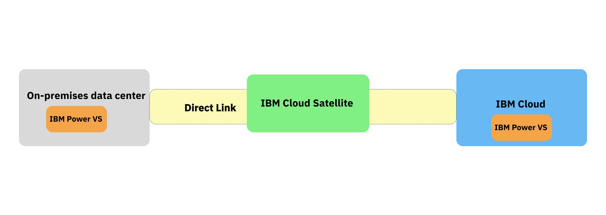

---
copyright:
  years: 2024
lastupdated: "2024-07-31"

keywords: location management, locations, region

subcollection: hybrid-workloads

---

{{site.data.keyword.attribute-definition-list}}

# Why use hybrid cloud with {{site.data.keyword.IBM_notm}}?
{: #hybrid}

Hybrid cloud with {{site.data.keyword.IBM_notm}} enables a seamless integration of on-premises, public cloud, and edge environments to optimize your IT infrastructure. {{site.data.keyword.Bluemix_notm}} hybrid solutions connect your existing on-premises systems with the flexibility and scalability of the cloud for a unified and efficient application development environment. Use {{site.data.keyword.Bluemix_notm}}'s services and solutions that are designed to support and manage secure, scalable, and cost-effective hybrid environments.
{: shortdesc}

Managing workloads in hybrid environments allows you to leverage the best of both on-premises and cloud infrastructure. This approach provides greater flexibility and scalability compared to a single public or private cloud solution.

## What is hybrid cloud?
{: #why-hybrid}

Hybrid cloud is an infrastructure that integrates on-premises data centers and public cloud services. By integrating private and public resources, you can share data and applications between both environments to create a unified, flexible, and optimized computing environment.

A hybrid strategy gives you the flexibilty to run workloads in the appopriate environment based on cost, performance, and regulatory requirements. For example, you might leverage a public cloud to scale resources while maintaining critical workloads on-premises. This way, you can meet security and compliance requirements by keeping sensitive data on-premises and use the public cloud for less sensitive workloads.

Let's say that you have on-premises storage devices. You can determine which workloads and applications are best positioned to move to the cloud by considering factors like scalability, compliance, data sensitivity, and performance requirements. As a first step, you might decide to use cloud storage solutions for data that needs to be scalable or highly available. For more information, see [Assessing your current applications](/docs-draft/hybrid-workloads?topic=hybrid-workloads-assess-hybrid).

You might have a hybrid setup, but it might not be truly optimized. With {{site.data.keyword.satellitelong_notm}}, you can manage all of your environments through a single pane of glass. With a unified view, you can deploy and manage workloads seamlessly across your entire infrastructure. Eliminate fragmented management and embrace streamlined operations with the following core {{site.data.keyword.Bluemix_notm}} services for hybrid environments.

### On-premises
{: #on-prem}

On-premises refers to computing resources and infrastructure that are physically located within an organization's own facilities, such as a data center or servers, storage devices and networking hardware.

On-premises solutions are often used for critical applications, sensitive data, or in industries with strict compliance and regulatory requirements.

#### Private cloud
{: #private-cloud}

A private cloud is a cloud computing environment dedicated to a single organization. It offers similar benefits to a public cloud, such as scalability and self-service, but is operated solely for that organization. An example of a private cloud offering is IBM Power Virtual Server on-premises.

### Off-premises
{: #off-prem}

Off-premises refers to computing resources that are hosted and managed outside of an organization's physical location. This typically includes cloud services provided by third-party vendors.

Off-premises solutions are commonly used for web applications, storage, disaster recovery, and workloads that require elasticity and scalability.

#### Public Cloud
{: #public cloud}

A public cloud is a cloud computing environment where resources are shared among multiple organizations. It is owned and operated by a third-party cloud service provider who offers computing resources, such as servers and storage, over the internet.

### Edge
{: #edge}

Edge computing refers to the deployment of computing resources and services closer to the location where data is generated or consumed. Edge computing can be considered a mix of both on-premises and off-premises, depending on the deployment context and who owns and manages the infrastructure.

When edge devices or infrastructure are located on the organization's property, such as in a factory, and are owned and managed by the organization, it is considered on-premises.In cases where edge infrastructure is provided and managed by a third-party service provider, and it is located outside the organization's owned facilities, it can be considered off-premises.

## Core {{site.data.keyword.Bluemix_notm}} services for hybrid environments
{: #services-hybrid}

{{site.data.keyword.satellitelong_notm}}
:   Extends {{site.data.keyword.Bluemix_notm}} services to on-premises, edge, and other cloud environments. It allows organizations to run and manage cloud services consistently across any location.

{{site.data.keyword.dl_full_notm}}
:   A high-speed and secure connectivity between on-premises data centers and {{site.data.keyword.Bluemix_notm}}, enabling seamless data transfer and integration.

{{site.data.keyword.IBM_notm}} Power Systems
:   Install and configure {{site.data.keyword.powerSys_notm}} on-premises within your data center to support critical workloads with enterprise level reliability. Deploy {{site.data.keyword.powerSys_notm}} on {{site.data.keyword.Bluemix_notm}} for scalable and flexible cloud resources and seamless integration with your on-premises infrastructure.

{: caption="Figure 1. A diagram that shows the components of a basic hybrid infrastructure" caption-side="bottom"}

Your on-premises data center and {{site.data.keyword.Bluemix_notm}} connect through {{site.data.keyword.dl_full_notm}}, ensuring secure and high-speed data transfer. {{site.data.keyword.satellitelong_notm}} provides a single management interface to oversee both on-premises and cloud resources, ensuring unified operations. {{site.data.keyword.powerSys_notm}} on {{site.data.keyword.Bluemix_notm}} seamlessly extends on-prem IBM Power Systems workloads to the cloud, providing scalability and flexibility.

